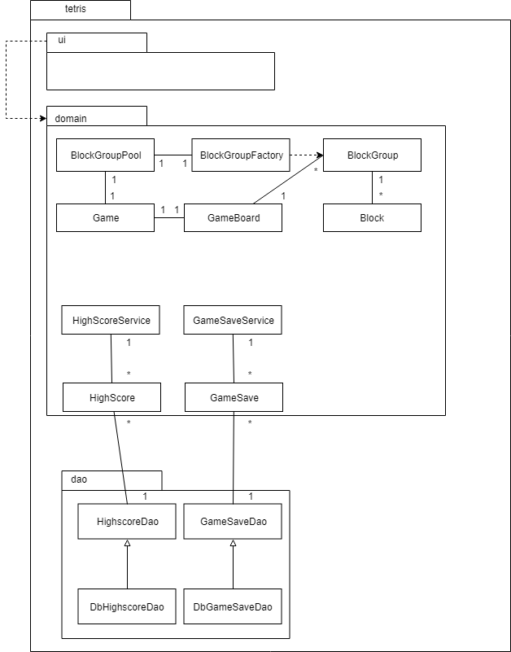
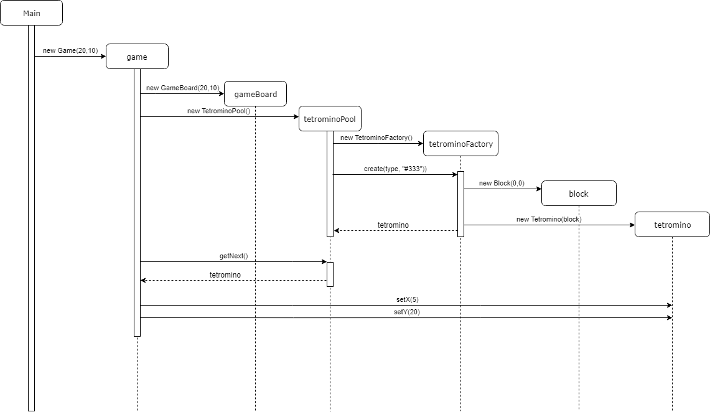

# Arkkitehtuuri

## Rakenne

Ohjelma jakautuu kolmeen tasoon, `tetris.domain`, `tetris.dao` ja `tetris.ui`. `tetris.domain` vastaa pelin logiikasta. `tetris.dao` vastaa pelien ja huipputuloksien lukemisesta ja tallentamisesta. `tetris.domain` vastaa pelin käyttöliittymästä.

#### Luokkakaavio

## Käyttöliittymä

Käyttöliittymään kuuluu tällä hetkellä kaksi näkymää:
* Valikko
* Pelinäkymä

Tarkoitus on vielä lisätä seuraavat näkymät:

* Huipputulokset
* Tallennetut (keskeneräiset) pelit

Näkymät on eriytetty pelin logiikasta. Näkymät on määritelty fxml tiedostoina sen sijaan että näkymät luotaisiin koodissa.

## Sovelluslogiikka

Pelin tärkein luokka on [Game](../../../tree/master/Tetris/src/main/java/tetris/domain/Game.java) joka vastaa koko pelilogiikasta. Luokan julkiset metodit ovat update metodin lisäksi lähinnä gettereitä ja settereitä. `void update(float dt)` on ainoa julkinen metodi joka muuttaa pelin tilaa.

#### Pelin alustus - Sekvenssikaavio

## Tiedon tallennus

`tetris.dao` paketin `DbGameSaveDao` ja `DbHighscoreDao` vastaa pysyvien tietojen lukemisesta ja tallentamisesta.

Peli käyttää SQLite tietokantaa pelien ja huipputuloksien tallentamiseen. SQLite tietokanta sijoitetaan aina samaan kansioon, kuin missä ajettava jar tiedosto sijaitsee. Mikäli tietokantaa ei löydy, ohjelma luo sellaisen.

Testaukseen käytetään SQLiten im-memory moodia.

