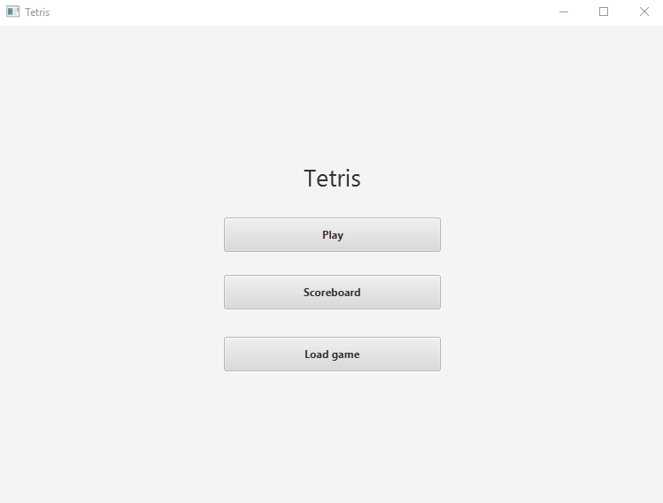
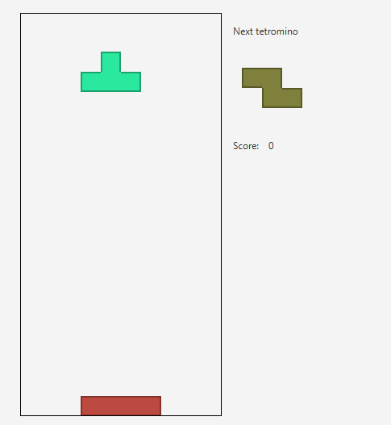

# Käyttöohjeet

Lataa [Tetris.jar](https://github.com/FINDarkside/ot-harjoitustyo/releases/tag/viikko6).

Käynnistä jar tiedosto komennolla `java -jar Tetris.jar`

## Pelin aloitus

"Play" nappia painamalla peli alkaa.

## Pelin pelaaminen

Pelinäkymä näyttää seuraavalta:

Pelin kontrollit ovat seuraavat:
* Vasen nuolinäppäin - Siirtää tippuvaa tetrominoa vasemmalle
* Oikea nuolinäppäin - Siirtää tippuvaa tetrominoa oikealle
* Nuoli alaspäin - Tiputtaa tippuvan tetrominon maaahan
* Ylös nuolinäppäin - Kääntää tetrominoa myötäpäivään

Pelin tavoite on täyttää kokonaisia rivejä palikoilla. Voit ohjata tippuvaa palikkaa nuolinäppäimillä ja pyörittää 
sitä sopivampaan asentoon nuoli ylös näppäimellä. Tippuvat tetrominot kasaantuvat toistensa päälle.
Kun koko rivi on täynnä, rivi poistuu ja saat yhden pisteen. Pisteet näkyvät pelinäkymän oikeassa reunassa.

Peli päättyy kun palikkakasan ylin palikka ei enää mahdu pelialueelle.
