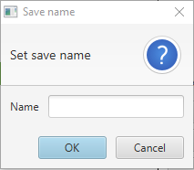
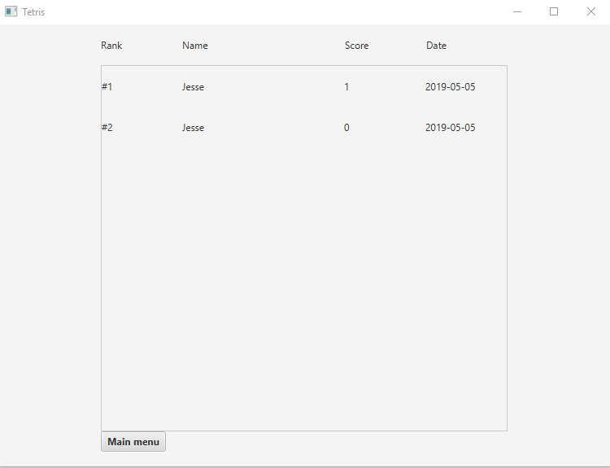

# Käyttöohjeet

Lataa [Tetris.jar](https://github.com/FINDarkside/ot-harjoitustyo/releases/tag/viikko6).

Käynnistä jar tiedosto komennolla `java -jar Tetris.jar`

## Päävalikko

* Pelin voi aloittaa painamalla "Play"
* "Scoreboad" siirtyy huipputulos näkymään
* "Load game" siirtyy tallennetun pelien näkymään

## Pelinäkymä

Pelinäkymä näyttää seuraavalta:

Pelin kontrollit ovat seuraavat:
* Vasen nuolinäppäin - Siirtää tippuvaa tetrominoa vasemmalle
* Oikea nuolinäppäin - Siirtää tippuvaa tetrominoa oikealle
* Nuoli alaspäin - Tiputtaa tippuvan tetrominon maaahan. Pelinäkymässä näkyvät reunaviivat kertovat mihin palikka tippuu.
* Ylös nuolinäppäin - Kääntää tetrominoa myötäpäivään
* Näkymässä näkyvä "Pause" nappi pysäyttää pelin. Tällöin napin teksti muuttuu "Continue", ja napilla voi jatkaa peliä.
* Näkymässä näkyvä "Save" nappia painamalla voi tallentaa pelin.
* Näkymässä näkyvä "Menu" nappia ohjelma siirtyy takaisin päävalikkoon.

Pelin tavoite on täyttää kokonaisia rivejä palikoilla. Voit ohjata tippuvaa palikkaa nuolinäppäimillä ja pyörittää 
sitä sopivampaan asentoon nuoli ylös näppäimellä. Tippuvat tetrominot kasaantuvat toistensa päälle.
Kun koko rivi on täynnä, rivi poistuu ja saat yhden pisteen. Pisteet näkyvät pelinäkymän oikeassa reunassa.

Peli päättyy kun palikkakasan ylin palikka ei enää mahdu pelialueelle.

### Pelin tallentaminen

Kun painat pelinäkymällä "Save" nappia, ohjelma kysyy sinulta pelitallennukselle nimeä, minkä jälkeen peli tallennetaan ja 
ohjelma siirtyy päävalikkoon.

## Tallennettujen pelien näkymä

Näkymässä on listattu kaikki tallennetut pelit, niille annetut nimet, pelin senhetkiset pisteet ja tallennusajankohta.

* "Load" nappi lataa kyseisen pelin, ja siirtyy pelinäkymään
* "Delete" nappi poistaa kyseisen pelin pysyvästi
* "Back to memu" nappia painamalla ohjelma siirtyy takaisin päävalikkoon

## Huipputulos näkymä

Näkymässä on listattu kaikkien loppuneiden pelien tulokset. Pelit on järjestetty korkeimmasta pistemäärästä matalimpaan.

* "Main menu" nappia painamalla ohjelma siirtyy takaisin päävalikkoon
