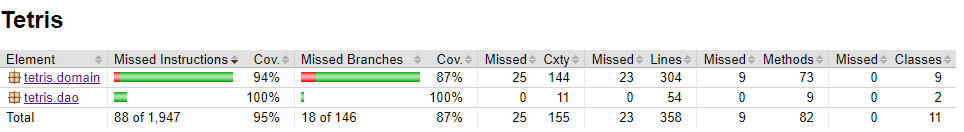

# Testausdokumentti

Ohjelmaa on testattu automaattisilla yksikkö- ja integraatiotesteillä. Lisäksi ohjelmaa on myös testattu manuaalisesti.

## Yksikkö- ja integraatiotestaus

### Sovelluslogiikka
[Tetromino](https://github.com/FINDarkside/ot-harjoitustyo/blob/master/Tetris/src/test/java/tetris/domain/TetrominoTest.java) 
ja [GameBoard](https://github.com/FINDarkside/ot-harjoitustyo/blob/master/Tetris/src/test/java/tetris/domain/GameBoardTest.java) 
luokille on kirjoitettu yksikkötestejä. [GameTest](https://github.com/FINDarkside/ot-harjoitustyo/blob/master/Tetris/src/test/java/tetris/domain/GameTest.java)
taas testaa laajemmin usean eri luokan yhteistoimintaa.

### DAO

DAO luokkia on testattu käyttämällä hyväksi SQLite tietokannan [in-memory](https://www.sqlite.org/inmemorydb.html) moodia.

## Testauskattavuus

Käyttöliittymäluokkia lukuunottamatta testien rivikattavuus on 95% ja haarautumakattavuus 87%

Testaamatta jäi muutamia erityistapauksia, esim. tapauksia joissa inputLeft ei siirrä aktiivista tetriminoa 
vasemmalle, koska tetromino on jo pelialueen vasemmassa reunassa.

## Järjestelmätestaus

Sovelluksen järjestelmätestaus on suoritettu manuaalisesti.

### Asennus ja konfigurointi

Sovellusta on testattu käyttöohjeiden mukaan Windows ja Linux ympäristöissä.

### Toiminnallisuudet

Kaikki määrittelydokumentin toiminnallisuudet on käyty läpi, ja varmistettu että ne toimivat halutulla tavalla.

## Sovellukseen jääneet laatuongelmat

Monessa labelissa ja buttonissa on tarpeettomasti määritelty preferredWidth. Joillain tietokoneilla teksti on eri kokoista kuin omalla kehityskoneella, jolloin osa labeleitten ja buttoneiden tekstistä leikkautuu pois.
